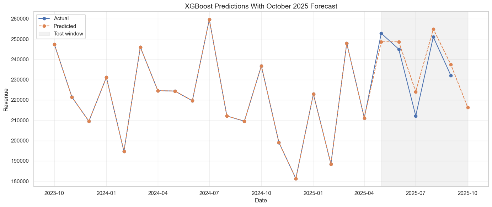
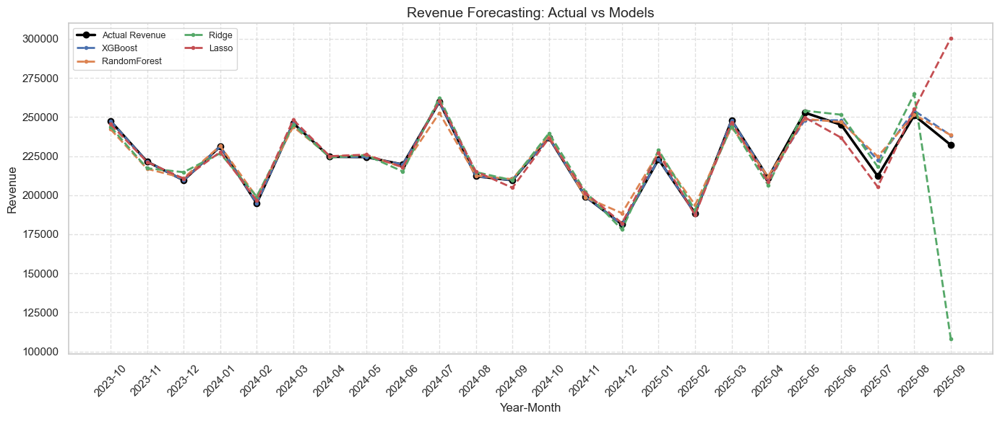

# 📈 Sales Revenue Forecasting System

A complete end-to-end machine learning pipeline for revenue forecasting, combining database engineering, statistical modeling, and advanced ML techniques to predict future sales performance.

[](https://www.python.org/downloads/)
[](https://www.postgresql.org/)
[](https://www.docker.com/)
[](https://xgboost.readthedocs.io/)

## 🎯 Project Overview

This project implements a production-ready revenue forecasting system that processes transaction-level sales data and generates accurate monthly revenue predictions. The system compares multiple modeling approaches including statistical methods (ARIMA/SARIMA) and machine learning (XGBoost), delivering actionable insights for business planning.

**Key Results:**
- 📊 Achieved **R² > 0.85** on test data using multivariate XGBoost
- 🎯 October 2025 revenue forecast with comprehensive model validation
- 🔍 Identified top revenue-driving features through feature importance analysis
- ⚡ Optimized hyperparameters using Optuna (250+ trials)

## 🚀 Quick Start

### Prerequisites
- Docker Desktop installed and running
- Python 3.8 or higher
- VS Code (recommended)

### Setup in 3 Steps

1. **Clone the repository**
   ```bash
   git clone https://github.com/your-username/sales-forecasting.git
   cd sales-forecasting
   ```

2. **Start the database**
   ```bash
   docker-compose up -d
   ```

3. **Install Python dependencies**
   ```bash
   pip install -r Requirements.txt
   ```

📖 **For detailed setup instructions, see [quickguide.md](quickguide.md)**

## 📂 Project Structure

```
Sales_prediction/
├── 📓 Sales_Data_Forecast_main.ipynb          # Main multivariate forecasting notebook
├── 📓 Prediction_with_univariate_Extra.ipynb  # Univariate comparison models
├── 🐳 docker-compose.yaml                     # PostgreSQL database setup
├── 📋 Requirements.txt                        # Python dependencies
├── 🗄️ Schema_table_creation.sql              # Database schema
├── 🔍 querries.sql                            # Business analytics queries
├── 📊 Sales_data/                             # CSV datasets
│   ├── customers.csv
│   ├── orders.csv
│   ├── order_items.csv
│   └── products.csv
├── 📸 Final_forecast.png                      # Forecast visualization
└── 📸 Revenue_forecast_comparision.png        # Model comparison
```

## 🛠️ Technical Architecture

### Data Pipeline
```
CSV Files → PostgreSQL → Python/Pandas → Feature Engineering → ML Models → Predictions
```

### Technology Stack
- **Database**: PostgreSQL 16 (Docker containerized)
- **Data Processing**: Pandas, NumPy
- **Statistical Models**: Statsmodels (ARIMA/SARIMA)
- **Machine Learning**: XGBoost with Optuna optimization
- **Visualization**: Matplotlib, Seaborn
- **Environment**: SQLAlchemy, python-dotenv

## 🧮 Models Implemented

### 1. Multivariate XGBoost (Primary Model)
- **Features**: 15+ engineered features including customer behavior, operational metrics, temporal patterns
- **Optimization**: Optuna hyperparameter tuning (250 trials)
- **Performance**: Best overall accuracy with comprehensive feature analysis

### 2. Univariate Models (Baseline Comparison)
- **ARIMA**: Classical time series forecasting
- **SARIMA**: Seasonal ARIMA with trend components
- **XGBoost (Univariate)**: With lag features and rolling statistics

**📊 For detailed methodology and results, see [SUMMARY.md](SUMMARY.md)**

## 📈 Key Features

- ✅ **Automated Feature Engineering**: Creates customer loyalty, product diversity, and operational health metrics
- ✅ **Data Quality Handling**: Extrapolates partial months and handles missing data
- ✅ **Comprehensive Evaluation**: MAE, RMSE, R², MAPE, sMAPE with diagnostic plots
- ✅ **Model Interpretability**: Feature importance analysis and residual diagnostics
- ✅ **Production-Ready Code**: Modular functions, error handling, memory optimization

## 🎨 Sample Visualizations

### Revenue Forecast


### Model Comparison


## 🔐 Environment Configuration

Create a `.env` file in the project root:

```env
PG_USER=your_username
PG_PASSWORD=your_password
PG_DB=your_database
PG_PORT=5432
```

**⚠️ Never commit your `.env` file to version control**

## 📊 Business Insights

The analysis reveals:
- **Seasonal Patterns**: Moderate seasonality with peaks in spring/summer months
- **Customer Behavior**: Repeat customer share strongly correlates with revenue
- **Product Mix**: Electronics and Home Goods drive majority of sales
- **Operational Health**: Order completion rates serve as leading indicators

## 🤝 Contributing

This is a portfolio project. Feel free to fork and adapt for your own use cases!

## 📝 License

This project is available under the MIT License.

## 👤 Author

**Your Name**
- GitHub: [Gururaz](https://github.com/Gururaz)
- LinkedIn: [Gururaj_Horakeri](https://linkedin.com/in/gururaj-horakeri-59b51485)

---

⭐ **If you found this project helpful, please give it a star!**

## 📚 Additional Resources

- [Quick Start Guide](quickguide.md) - Step-by-step setup instructions
- [Detailed Analysis](SUMMARY.md) - Complete methodology and findings
- [SQL Queries](querries.sql) - Business analytics examples
